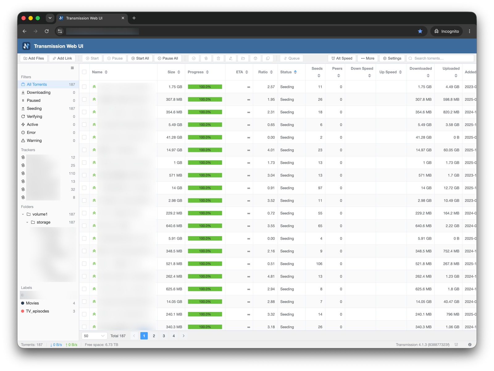

# Transmission Web UI

[中文文档](README.zh-CN.md)

A modern web UI for **Transmission 4.1+**, designed as a replacement for the default web interface.



## Requirements

- **Transmission ≥ 4.1** (`rpc_version_semver ≥ 6.0.0`). The version is checked on startup; older daemons trigger a banner warning. **Older Transmission versions (incl. 4.0.x) and the classic RPC protocol are not supported.**
- A modern desktop browser (desktop only).

## Installation

### Quick Install (Pre-built Release)

Install the latest release directly via a one-line command:

```bash
# Auto-detect web directory and install latest release
curl -fsSL https://raw.githubusercontent.com/QfeEBQciZg/transmission-web-ui/main/scripts/install.sh | bash

# Or specify target directory / custom options
curl -fsSL https://raw.githubusercontent.com/QfeEBQciZg/transmission-web-ui/main/scripts/install.sh | bash -s -- /usr/share/transmission/public_html
```

### Build from Source

You can also clone the repository and build locally:

```bash
npm install
npm run build
scripts/install.sh                     # auto-detect web dir, installs local dist/
scripts/install.sh /path/to/webdir     # or set TRANSMISSION_WEB_HOME
scripts/install.sh --dist /path/to/dist   # install a build from any directory
scripts/install.sh --restore           # restore the stock UI
```

## Development & Maintenance

This project is written and maintained with the assistance of AI, under human direction and code review.

## License

[MIT](LICENSE)

