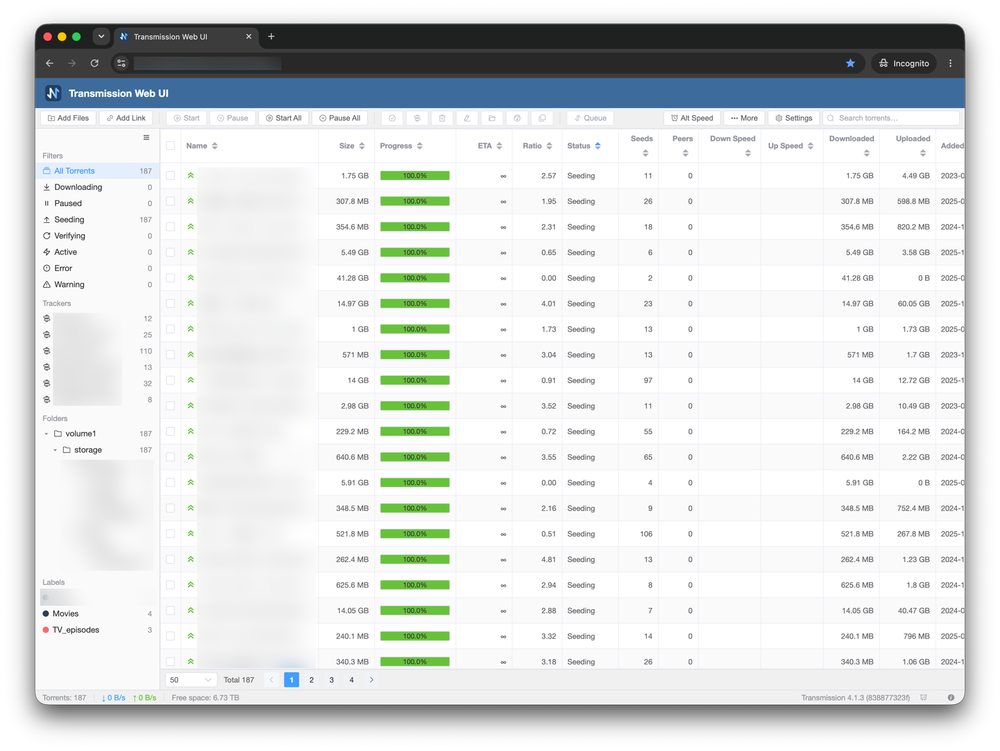

# Transmission Web UI

[English](README.md)

为 **Transmission 4.1+** 打造的现代 WebUI，用以替代默认控制界面。



## 要求

- **Transmission ≥ 4.1**（`rpc_version_semver ≥ 6.0.0`）。**不支持旧版 Transmission（含 4.0.x），不兼容经典 RPC 协议**。
- 浏览器：现代桌面浏览器（暂未适配移动端）。

## 安装

### 快速安装（预构建 Release）

一行命令直接下载并安装最新 Release：

```bash
# 自动检测 web 目录并安装最新版本
curl -fsSL https://raw.githubusercontent.com/QfeEBQciZg/transmission-web-ui/main/scripts/install.sh | bash

# 或显式指定目标目录 / 其它参数
curl -fsSL https://raw.githubusercontent.com/QfeEBQciZg/transmission-web-ui/main/scripts/install.sh | bash -s -- /usr/share/transmission/public_html

# 恢复官方界面
curl -fsSL https://raw.githubusercontent.com/QfeEBQciZg/transmission-web-ui/main/scripts/install.sh | bash -s -- --restore
```

### 源码构建安装

也可克隆源码后本地构建安装：

```bash
npm install
npm run build
scripts/install.sh                     # 自动检测 web 目录，优先安装本地 dist/
scripts/install.sh /path/to/webdir     # 手动指定 web 目录（亦可配置 TRANSMISSION_WEB_HOME 环境变量）
scripts/install.sh --dist /path/to/dist   # 安装任意指定位置的构建产物
scripts/install.sh --restore           # 恢复官方界面
```

## 开发与维护说明

本项目使用 AI 辅助编写与维护，全程由人工进行设计指导与代码审查。

## 许可证

[MIT](LICENSE)
